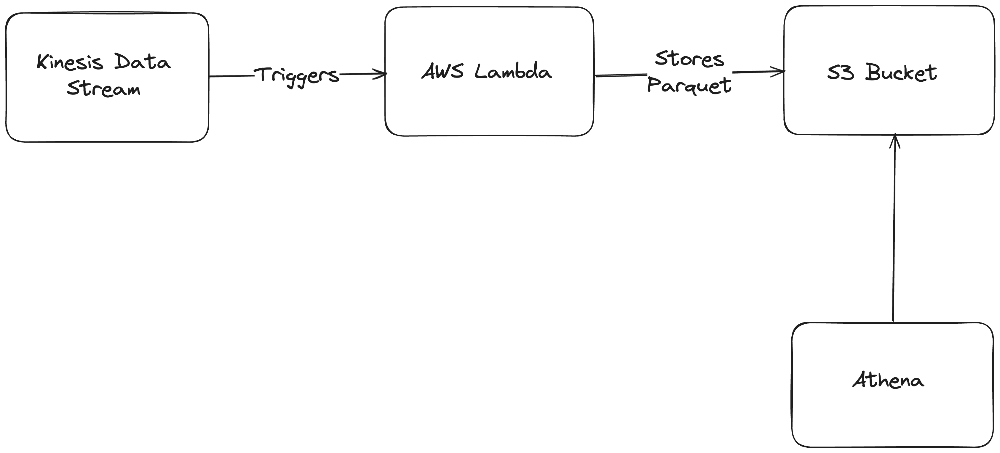

# Data Processing Solution with AWS

## Architecture Overview

The solution architecture is designed to capture, process, and store streaming data using AWS services. The architecture facilitates real-time data processing and ensures the data is readily available for analysis. Below is an overview of the architecture components and the flow of data:

### Main Components

The architecture consists of three primary components, each serving a specific role in the data processing pipeline:

#### AWS Kinesis Data Streams
- **Purpose**: Captures and temporarily stores the streaming data, providing a robust solution for handling large volumes of data in real time.

#### AWS Lambda
- **Purpose**: Processes the streaming data from Kinesis Data Streams. The processing involves:
  - Data transformations
  - Converting processed data into Parquet format
- **Why Chosen**: AWS Lambda is chosen for its serverless execution model, which simplifies infrastructure management by abstracting it away. This model supports event-driven processing, making it perfectly suited for responding to events from Kinesis Data Streams. Lambda can automatically scale with the volume of incoming data and is cost-effective, allowing payment only for the compute time used.

#### Amazon S3
- **Purpose**: Stores the processed data in Parquet format, providing durable storage for large-scale data analysis.
- **Why Chosen**: Amazon S3 is an ideal storage solution for Parquet files due to its compatibility with various data analysis tools and services within AWS (e.g., Amazon Athena). It offers a low-cost solution for storing large amounts of data securely and reliably.

### Design Questions 

- **How to handle duplicate events?**  
For handling duplicate events, I would ingest all events as they come through, without trying to filter out duplicates upfront. Then, in a downstream staging layer, I would employ a deduplication process that leverages the unique UUID of each event. This process could involve sorting or grouping events by their UUID and then either removing duplicates or selecting a single instance of each event based on specific criteria (such as the latest timestamp). This approach allows for the efficient handling of incoming data without the need for complex logic in the ingestion phase, relying on the staging layer to ensure data quality and uniqueness.

- **How I would partition the data to ensure good querying performance and scalability?**  
Partitioning is already being handled well in the code by organizing data into directories based on year, month, and day within the S3 bucket. This partitioning scheme allows for efficient querying, especially when using AWS Athena or similar services, as it minimizes the amount of data scanned for time-based queries. For even better performance and scalability, I might consider by event type partition if the volume of events is high and queries frequently filter on this field.

- **What format I would use to store the data?**  
The choice of Parquet format for storing data, as demonstrated in the code, is optimal. Parquet is a columnar storage file format that offers efficient data compression. it is highly optimized for query performance and minimizing I/O, making it ideal for analytical workloads on large datasets.

- **How I would test different components of your proposed architecture?**  
    - **Unit Testing:** I would write unit tests for individual functions within the Lambda code, mocking external services like S3 and Kinesis.  
    - **Integration Testing:** Deploy the architecture in a development environment and use test data to simulate real streaming data. Verify that the data flows through Kinesis to Lambda and is correctly processed and stored in S3.  
    - **Load Testing:** Simulate high volumes of data to ensure the system can handle peak loads and that the Lambda function scales appropriately.

- **How I would ensure that the architecture deployed can be replicable across environments?**  
As done in the code, I leveraged terraform and makefile to automate the entire deployment from infrastructure setup to code build and deployment. The appropriate parameters just need to be set for different environments - this can be integrated into the CI/CD flow. 

- **Would my proposed solution still be the same if the amount of events is 1000 times smaller or bigger?**  
Absolutely! That is actually the reason why I used AWS Lambda and S3 as it is effective for both big and small data, scaling efficiently.

- **Would my proposed solution still be the same if adding fields / transforming the data is no longer needed?**  
Yes, the solution would still be viable even if data transformation is not required because the architecture efficiently handles data ingestion, processing, and storage. However, if no processing is needed at all, I could potentially simplify the architecture by using Kinesis firehose.

### Steps to deploy the infrastructure and lambda code

- Assign the necessary permissions
  - `s3:CreateBucket`
  - `s3:*`
  - `lambda:CreateFunction`
  - `lambda:InvokeFunction`
  - `iam:CreateRole`
  - `iam:PutRolePolicy` or `iam:AttachRolePolicy`
  - `ecr:GetLoginPassword`
  - `ecr:CreateRepository`
  - `ecr:PutImage`
- cd into `lambda-function` directory
- run `make deploy_fresh`